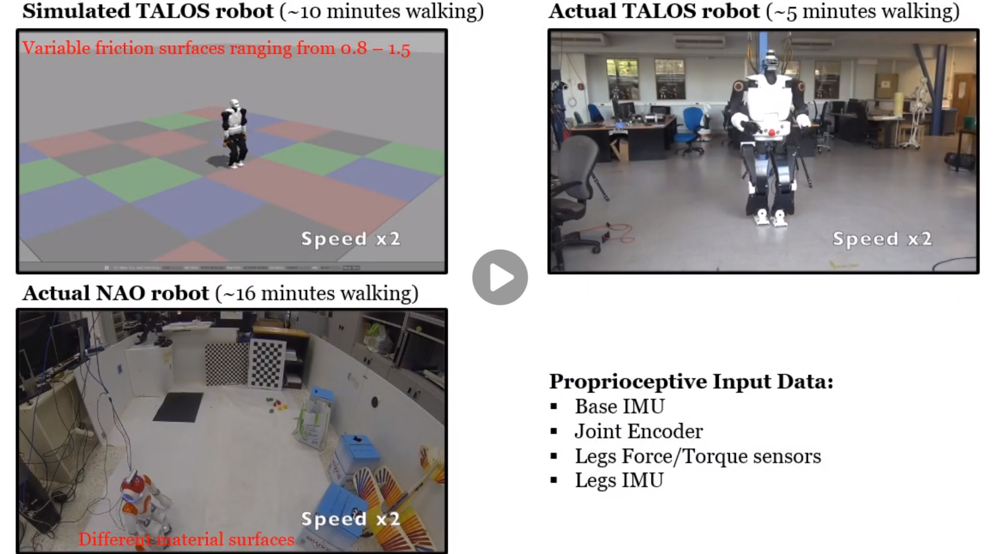

# gem2
Gait-phase Estimation Module 2 (GEM2) for Humanoid Robot Walking. The code is open-source (BSD License). Please note that this work is an on-going research and thus some parts are not fully developed yet. Furthermore, the code will be subject to changes in the future which could include greater re-factoring.

GEM2 is a machine learning framework that combines effectively unsupervised and supervised learning in a semi-supervised setting to  facilitate accurate prediction/classification of the gait phase during locomotion based solely on proprioceptive sensing.

GEM2 can be used for real-time gait phase estimation. The latter functionality facilitates 3D-base/CoM estimation with the State Estimation for RObot Walking (SEROW) framework (https://github.com/mrsp/serow). 

Papers: 
* Gait-Phase Estimation for Humanoid Robots (Intl. Conf. on Robotics and Automation (ICRA), 2021 - under review)

## GEM2 State Publisher (https://github.com/mrsp/gem2_state_publisher) 
A ROS - C/C++ package for gathering  all necessary data for GEM2 in real-time.

## Training
Solely proprioceptive sensing is utilized in training, namely joint encoder, F/T, and IMUs.

## Comparison to State-of-the-art

## Getting Started
These instructions will get you a copy of the project up and running on your local machine for development and testing purposes.

## Prerequisites
* Ubuntu 16.04 and later
* ROS kinetic and later
* Sklearn 
* tensorflow 
* tested on  python (2.7.12, 2.7.17) and python3 (3.5.2, 3.6.9)

## Installing
* pip install sklearn
* pip install tensorflow (or pip install tensorflow-gpu if an nvidia gpu is installed)
* git clone https://github.com/mrsp/gem2.git
* catkin_make
* If you are using catkin tools run: catkin build  

## ROS Examples

### Train your own module
* Save the corresponding files in a similar form as in GEM2_training, GEM2_validation
* train: python train.py ../config/gem2_params_your_robot.yaml

### Run in real-time to infer the gait-phase:
* configure appropriately the config yaml file (in config folder) with the corresponding topics 
* roslaunch gem2_ros gem2_ros.launch

### GEM2 in base state estimation with SEROW and TALOS
The estimated GEM2 gait-phase is employed in kinematic-inertial base state estimation with SEROW (https://github.com/mrsp/serow)

